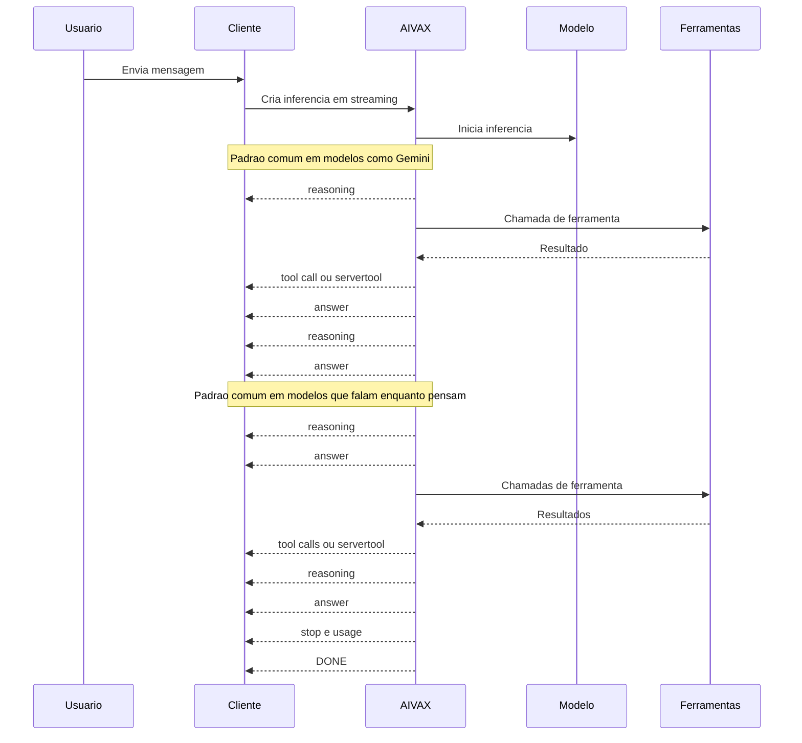

# Tratamento de chat

Clientes de chat que usam inferência por streaming devem tratar a resposta como uma linha do tempo de eventos, não como blocos separados por tipo de informação. Em uma única inferência, o modelo pode raciocinar, chamar ferramentas do lado do servidor, responder parcialmente, voltar a raciocinar e continuar a resposta. Essa sequência deve ser preservada na interface.

O comportamento mais importante é: cada pedaço recebido pelo SSE representa o próximo passo da resposta da assistente. O cliente deve construir a resposta na ordem em que os eventos chegam.

## Por que manter uma linha do tempo

Modelos diferentes organizam a resposta de formas diferentes. O diagrama de sequência abaixo representa dois comportamentos comuns dentro de uma única inferência:



Por isso, não é uma boa ideia renderizar um painel fixo para raciocínio e outro para conteúdo final como se fossem fluxos independentes. Com AIVAX, uma única inferência também pode resumir vários turnos internos por causa de ferramentas executadas no servidor, como MCP, pesquisa e outras funções embutidas. Se o cliente separar tudo por tipo, o usuário perde a ordem real do que aconteceu.

## Streaming SSE

Use `stream: true` no endpoint `POST /v1/chat/completions` para receber a resposta em Server-Sent Events (SSE):

```json
{
    "model": "my-gateway:50c3",
    "messages": [
        {
            "role": "user",
            "content": "Resuma os principais pontos deste documento."
        }
    ],
    "stream": true
}
```

Por padrão, o servidor envia pings periódicos para manter a conexão aberta. Envie o cabeçalho `Sse-Stream-Options: no-ping` quando o seu cliente ou proxy não aceitar mensagens de keep-alive no SSE.

Cada evento de conteúdo segue o formato `chat.completion.chunk`:

```json
{
    "id": "chatcmpl-...",
    "object": "chat.completion.chunk",
    "created": 1755874904,
    "model": "@openai/gpt-5-mini",
    "system_fingerprint": "fp_abc123",
    "choices": [
        {
            "index": 0,
            "finish_reason": null,
            "logprobs": null,
            "delta": {
                "role": "assistant",
                "content": "A resposta começa aqui"
            }
        }
    ],
    "usage": null
}
```

O primeiro chunk útil inclui `delta.role: "assistant"`. Os chunks seguintes podem trazer `delta.content`, `delta.reasoning`, `delta.tool_calls` ou uma combinação desses campos. Chunks sem conteúdo, raciocínio, ferramentas ou uso são ignorados pelo servidor e não chegam ao cliente.

## Como renderizar

Dentro de uma resposta em andamento, renderize cada informação na ordem recebida:

- `delta.content`: adiciona texto visível na fala da assistente;
- `delta.reasoning`: adiciona um evento de raciocínio no ponto atual da resposta;
- `delta.tool_calls`: adiciona ou atualiza uma chamada de ferramenta no ponto atual da resposta;
- `servertool`: adiciona ou atualiza um evento de ferramenta executada pelo servidor;
- `finish_reason: "stop"`: encerra a resposta normalmente;
- `finish_reason: "error"`: encerra a resposta com erro.

O chat pode estilizar cada tipo de evento de forma diferente, mas a ordem deve continuar sendo uma só. Por exemplo, um trecho de raciocínio pode aparecer como uma linha discreta ou recolhível dentro da própria resposta da assistente, seguido pela ferramenta chamada e depois pelo texto que veio depois. O ponto essencial é não mover todos os raciocínios para uma área separada e todos os textos para outra área, porque isso desmonta a sequência da inferência.

## Raciocínio

Quando o modelo ou gateway retorna tokens de raciocínio, o chunk inclui `delta.reasoning`:

```json
{
    "choices": [
        {
            "index": 0,
            "finish_reason": null,
            "logprobs": null,
            "delta": {
                "reasoning": "Analisando os critérios relevantes..."
            }
        }
    ]
}
```

Esse campo não substitui `delta.content`. Ele representa um evento próprio no fluxo da resposta. Se o cliente optar por mostrar raciocínio, mostre-o na posição em que ele chegou. Se o cliente optar por ocultar raciocínio, preserve a ordem dos demais eventos e continue renderizando conteúdo e ferramentas normalmente.

## Ferramentas

Chamadas de ferramenta do modelo chegam em `delta.tool_calls` usando o formato de function calling:

```json
{
    "choices": [
        {
            "index": 0,
            "finish_reason": null,
            "delta": {
                "tool_calls": [
                    {
                        "index": 0,
                        "id": "call_...",
                        "type": "function",
                        "function": {
                            "name": "search_documents",
                            "arguments": "{\"query\":\"contrato\"}"
                        }
                    }
                ]
            }
        }
    ]
}
```

O campo `function.arguments` é entregue como texto e pode representar JSON parcial enquanto a geração ainda está em andamento. Em chats contínuos, atualize a chamada de ferramenta conforme novos dados chegarem e só interprete os argumentos quando estiverem completos.

Ferramentas internas do gateway podem enviar eventos de atualização no mesmo stream. Esses eventos usam `choices: []` e o objeto `servertool`:

```json
{
    "id": "chatcmpl-...",
    "object": "chat.completion.chunk",
    "created": 1755874904,
    "model": "@openai/gpt-5-mini",
    "system_fingerprint": "fp_abc123",
    "choices": [],
    "servertool": {
        "name": "WebSearch",
        "id": "tool_...",
        "contents": "{\"query\":\"notícias recentes\"}",
        "state": "Running"
    },
    "usage": null
}
```

Use `servertool` para mostrar estados como “pesquisando”, “abrindo link” ou “executando ferramenta”. Esse evento também faz parte da linha do tempo da resposta, mas não deve ser concatenado como texto da assistente.

## Uso, finalização e erros

O uso de tokens não acompanha cada chunk. Quando disponível, ele aparece no último chunk antes de `[DONE]`, junto com `finish_reason: "stop"`:

```json
{
    "choices": [
        {
            "index": 0,
            "finish_reason": "stop",
            "logprobs": null,
            "delta": {}
        }
    ],
    "usage": {
        "prompt_tokens": 84,
        "completion_tokens": 16,
        "total_tokens": 1892,
        "prompt_tokens_details": {
            "cached_tokens": 1792,
            "audio_tokens": 0
        }
    }
}
```

Depois do último chunk, o servidor envia a linha `[DONE]` e fecha o SSE. Se ocorrer um erro durante o streaming, o servidor envia um chunk com `finish_reason: "error"`, um objeto `error` com a mensagem segura para o cliente e, em seguida, `[DONE]`.

```json
{
    "choices": [
        {
            "index": 0,
            "finish_reason": "error",
            "delta": {
                "content": ""
            }
        }
    ],
    "error": {
        "code": "server_error",
        "message": "Mensagem do erro"
    }
}
```

## Respostas JSON em streaming

Quando `json_only: true` é usado com `stream: true`, o comportamento muda: o servidor envia o JSON completo gerado pelo modelo como um único evento, depois envia `[DONE]`. Nesse modo, não há envelope `chat.completion.chunk`, `delta`, `usage` ou metadados de geração no conteúdo enviado.
