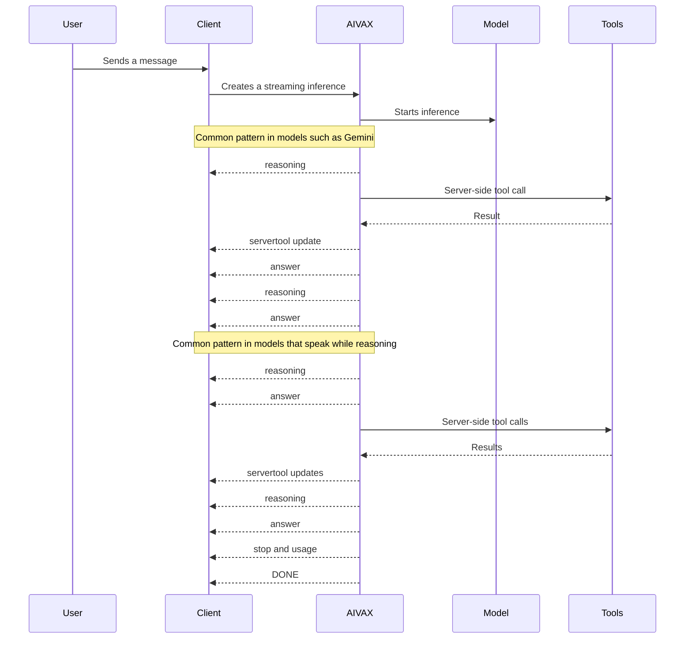

# Chat handling

Chat clients that use streaming inference must treat the response as a timeline of events, not as independent blocks grouped by type. In a single inference, the model can reason, call server-side tools, respond partially, resume reasoning, and continue the answer. The interface should preserve that sequence.

Each piece received via SSE represents the next step of the assistant's response. Build the response in the order the events arrive.

## Why keep a timeline

Different models organize the response in different ways. The sequence diagram below shows two common server-side tool patterns within a single inference:



Do not render a fixed panel for all reasoning and another fixed panel for final content as if they were independent streams. With AIVAX, a single inference can include multiple internal turns because of server-executed tools such as MCP, search, and other built-in functions. If the client separates everything by type, the user loses the real order of what happened.

## Streaming SSE

Use `stream: true` on `POST /v1/chat/completions` to receive the response in Server-Sent Events (SSE):

```json
{
    "model": "my-gateway:50c3",
    "messages": [
        {
            "role": "user",
            "content": "Summarize the main points of this document."
        }
    ],
    "stream": true
}
```

By default, the server sends periodic pings every 15 seconds to keep the connection open. Send the header `Sse-Stream-Options: no-ping` when your client or proxy does not accept keep-alive messages on SSE.

Each content event follows the `chat.completion.chunk` format:

```json
{
    "id": "chatcmpl-...",
    "object": "chat.completion.chunk",
    "created": 1755874904,
    "model": "@openai/gpt-5-mini",
    "system_fingerprint": "fp_abc123",
    "choices": [
        {
            "index": 0,
            "finish_reason": null,
            "logprobs": null,
            "delta": {
                "role": "assistant",
                "content": "The answer starts here"
            }
        }
    ],
    "usage": null
}
```

The first useful chunk includes `delta.role: "assistant"`. Subsequent chunks may contain `delta.content`, `delta.reasoning`, `delta.tool_calls`, or a combination of these fields. Empty chunks without content, reasoning, tools, or usage are not forwarded to the client.

## How to render

Within an in-progress response, render each piece of information in the order received:

- `delta.content`: Adds visible assistant text.
- `delta.reasoning`: Adds a reasoning event at the current point in the response.
- `delta.tool_calls`: Exposes a client-side tool call and ends the streamed turn with `finish_reason: "tool_calls"`.
- `servertool`: Adds or updates a server-executed tool event.
- `finish_reason: "stop"`: Ends the response normally.
- `finish_reason: "error"`: Ends the response with an error.

The chat UI can style each event type differently, but the order must remain a single sequence. For example, a reasoning snippet may appear as a discrete or collapsible line within the assistant's own response, followed by a tool event and then the subsequent text.

## Reasoning

When the model or gateway returns reasoning tokens, the chunk includes `delta.reasoning`:

```json
{
    "choices": [
        {
            "index": 0,
            "finish_reason": null,
            "logprobs": null,
            "delta": {
                "reasoning": "Analyzing the relevant criteria..."
            }
        }
    ]
}
```

This field does not replace `delta.content`. It represents its own event in the response flow. If the client shows reasoning, display it at the position where it arrives. If the client hides reasoning, preserve the order of the remaining events and continue rendering content and tools normally.

## Tools

Client-side model tool calls arrive in `delta.tool_calls` using the function-calling format:

```json
{
    "choices": [
        {
            "index": 0,
            "finish_reason": null,
            "delta": {
                "tool_calls": [
                    {
                        "index": 0,
                        "id": "call_...",
                        "type": "function",
                        "function": {
                            "name": "search_documents",
                            "arguments": "{\"query\":\"contract\"}"
                        }
                    }
                ]
            }
        }
    ]
}
```

The `function.arguments` field is delivered as JSON text. Parse it defensively after the tool call is complete. In AIVAX's OpenAI-compatible stream, a client-side tool call is followed by a final chunk with `finish_reason: "tool_calls"`.

Internal gateway tools can send update events on the same stream while AIVAX continues the server-side tool loop. These events use `choices: []` and the `servertool` object:

```json
{
    "id": "chatcmpl-...",
    "object": "chat.completion.chunk",
    "created": 1755874904,
    "model": "@openai/gpt-5-mini",
    "system_fingerprint": "fp_abc123",
    "choices": [],
    "servertool": {
        "name": "WebSearch",
        "id": "tool_...",
        "contents": "{\"query\":\"recent news\"}",
        "state": "Running"
    },
    "usage": null
}
```

Use `servertool` to show states such as "searching", "opening link", or "executing tool". This event is also part of the response timeline, but it should not be concatenated as assistant text.

## Usage, completion, and errors

Token usage is not attached to each chunk. When available, it appears in the last chunk before `[DONE]`, together with `finish_reason: "stop"` or `finish_reason: "tool_calls"`:

```json
{
    "choices": [
        {
            "index": 0,
            "finish_reason": "stop",
            "logprobs": null,
            "delta": {}
        }
    ],
    "usage": {
        "prompt_tokens": 84,
        "completion_tokens": 16,
        "total_tokens": 1892,
        "prompt_tokens_details": {
            "cached_tokens": 1792,
            "audio_tokens": 0
        }
    }
}
```

After the final chunk, the server sends the `[DONE]` line and closes the SSE. If an error occurs during streaming, the server sends a chunk with `finish_reason: "error"`, an `error` object with a client-safe message, and then `[DONE]`.

```json
{
    "choices": [
        {
            "index": 0,
            "finish_reason": "error",
            "delta": {
                "content": ""
            }
        }
    ],
    "error": {
        "code": "server_error",
        "message": "Error message"
    }
}
```

## Streaming JSON responses

When `json_only: true` is used with `stream: true`, the behavior changes: the server sends the complete JSON generated by the model as a single SSE data event, then sends `[DONE]`. In this mode, there is no `chat.completion.chunk` envelope, no `delta`, no `usage`, and no generation metadata in the transmitted content.
